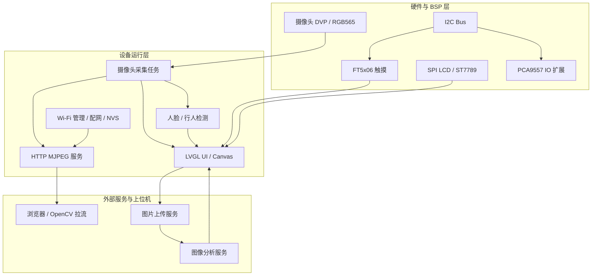

# esp_http_stream

基于 ESP32-S3 和 ESP-IDF 的嵌入式视觉交互终端项目，集成摄像头采集、LCD 本地显示、LVGL 触摸 UI、HTTP MJPEG 图传、Wi-Fi 配网、图片抓拍上传、云端图像分析和本地目标检测能力。

这个项目的目标不是单独验证某一个外设，而是打通一条完整的端侧视觉链路：

```text
摄像头采集 -> 本地屏幕预览 -> 触摸交互 -> 抓拍上传 -> 云端分析 -> 结果回显
                         |
                         +-> HTTP MJPEG 视频流
                         |
                         +-> 本地行人/人脸检测叠框
```

## 项目亮点

- **完整嵌入式视觉链路**：覆盖图像采集、显示、网络传输、上传分析和结果展示。
- **本地交互界面**：基于 LCD + LVGL + 触摸屏实现 `Start`、`Capture`、`Detect`、`Cancel` 等操作。
- **网络图传能力**：通过 ESP-IDF HTTP Server 输出 MJPEG 视频流，可被浏览器或 OpenCV 上位机读取。
- **Wi-Fi 配网与持久化**：支持 STA 连接、AP 配网页面、NVS 保存 Wi-Fi 配置和 mDNS 访问。
- **端云协同分析**：设备端抓拍并上传 JPEG，云端/局域网服务完成图像理解后将文本结果回显到设备屏幕。
- **端侧目标检测**：集成行人检测和人脸检测接口，可在 RGB565 framebuffer 上绘制检测框和关键点。
- **模块化工程结构**：网络、BSP、UI、检测模块拆分清晰，便于后续移植、裁剪和扩展。

## 技术栈

| 类型 | 技术/组件 |
| --- | --- |
| 主控平台 | ESP32-S3 |
| 开发框架 | ESP-IDF 5.x |
| 实时系统 | FreeRTOS |
| 摄像头 | esp32-camera，DVP，RGB565，QVGA 320x240 |
| 显示 | SPI LCD，ST7789，RGB565 |
| GUI | LVGL 9.x |
| 触摸 | FT5x06 / FT6336 系列触摸芯片 |
| IO 扩展 | PCA9557 |
| 网络 | Wi-Fi STA/AP，HTTP Server，HTTP Client，mDNS |
| 图像处理 | RGB565 转 JPEG，MJPEG stream |
| AI 能力 | ESP-DL，human_face_detect，pedestrian_detect，外部图像分析服务 |
| 上位机调试 | Python，OpenCV |

## 功能架构



## 主要功能

### 1. 摄像头采集与本地预览

- 配置 ESP32-S3 DVP 摄像头引脚、XCLK、RGB565 像素格式和 QVGA 分辨率。
- 使用 PSRAM 承载摄像头帧缓冲，降低内部 RAM 压力。
- 在 LVGL canvas 上显示摄像头画面，并支持本地检测框叠加。

相关代码：

- `components/BSP/bsp_camera.c`
- `components/BSP/inc/bsp_camera.h`
- `components/BSP/bsp_ui.c`

### 2. LCD、触摸与 LVGL UI

- 初始化 SPI LCD 面板，使用 DMA 缓冲分块刷屏。
- 初始化 LVGL display、flush 回调、tick 定时器和 UI 任务。
- 接入 FT5x06 触摸输入，支持设备端按钮交互。
- 主界面包含状态文本、AI 结果文本框和核心操作按钮。

相关代码：

- `components/BSP/bsp_lcd.c`
- `components/BSP/bsp_lvgl.c`
- `components/BSP/bsp_touch.c`
- `components/BSP/bsp_ui.c`

### 3. Wi-Fi、配网与服务发现

- 支持 STA 模式连接路由器。
- 支持 AP 模式启动配网页面，保存 SSID/密码到 NVS。
- 支持扫描附近 Wi-Fi，并通过事件组等待连接成功或失败。
- 通过 mDNS 注册 `esp32cam.local`，降低调试时查找 IP 的成本。

相关代码：

- `main/wifi_manager.c`
- `main/wifi_config.c`
- `main/config_server.c`
- `main/mdns_service.c`

### 4. HTTP MJPEG 视频流

- 提供浏览器预览首页。
- 通过 `/stream` 持续输出 MJPEG 视频流。
- 对非 JPEG 帧执行 `frame2jpg` 压缩后按 multipart chunk 发送。
- 可通过浏览器、OpenCV 或其他上位机程序接入。

相关代码：

- `main/http_server.c`
- `opencv.py`
- `opencv_viewer.py`
- `test.py`

### 5. 拍照上传与 AI 图像分析

- 点击 `Capture` 后创建独立 FreeRTOS 任务，避免阻塞 UI。
- 获取摄像头当前帧，必要时从 RGB565 转换为 JPEG。
- 使用 HTTP multipart/form-data 上传图片。
- 获取图片 URL 后提交给图像分析服务。
- 将返回的文本结果显示到 LVGL 文本框。

相关代码：

- `components/BSP/bsp_ui.c`
- `api_test.py`
- `test_api1.py`

### 6. 本地行人/人脸检测

- 封装 `human_face_detect` 与 `pedestrian_detect` 模型能力。
- 通过 C 接口桥接 C++ 检测对象，方便 C 侧 UI 和摄像头逻辑调用。
- 支持在 RGB565 framebuffer 上绘制检测框。
- 人脸检测结果支持关键点绘制。

相关代码：

- `components/human_detect/detection.c`
- `components/human_detect/middle_human_detect.cpp`
- `components/human_detect/inc/detection.h`

## HTTP 接口

| 路径 | 方法 | 说明 |
| --- | --- | --- |
| `/` | GET | 工作模式下的视频预览页；配网模式下的 Wi-Fi 配网页面 |
| `/stream` | GET | MJPEG 视频流 |
| `/favicon.ico` | GET | 返回 204，避免浏览器图标请求干扰日志 |
| `/wifi/save` | POST | 保存 Wi-Fi 配置并重启 |

## 本地 UI 操作

| 按钮 | 功能 |
| --- | --- |
| `Start` | 进入摄像头实时预览 |
| `Capture` | 抓拍当前画面，上传并请求图像分析 |
| `Detect` | 开启或关闭本地目标检测 |
| `Cancel` | 退出预览界面并恢复主界面 |

## 典型运行流程

### 本地屏幕交互

1. 设备上电并初始化 NVS、Wi-Fi、I2C、PCA9557、LCD、LVGL、触摸和摄像头。
2. 屏幕显示 LVGL 主界面。
3. 用户点击 `Start` 进入摄像头预览。
4. 用户点击 `Detect` 开启检测，检测框叠加到实时画面上。
5. 用户点击 `Cancel` 退出预览并恢复主界面。

### 抓拍上传分析

1. 用户点击 `Capture`。
2. 设备抓取当前摄像头帧。
3. 如果不是 JPEG 格式，则执行 JPEG 压缩。
4. 设备上传图片到外部服务。
5. 设备将图片 URL 发送给图像分析服务。
6. 分析结果回显到本地屏幕。

### 浏览器/上位机图传

1. 设备联网后启动 HTTP 服务和 mDNS。
2. 浏览器访问 `http://esp32cam.local/` 或设备 IP。
3. 页面通过 `` 拉取 MJPEG 视频流。
4. OpenCV 脚本也可以直接读取 `/stream` 做二次处理。

## 快速开始

### 1. 配置目标芯片

```bash
idf.py set-target esp32s3
```

### 2. 编译

```bash
idf.py build
```

### 3. 烧录并查看日志

```bash
idf.py flash monitor
```

### 4. OpenCV 拉流调试

```bash
python opencv_viewer.py
```

或使用固定 IP 测试：

```bash
python test.py
```

## 目录结构

```text
esp_http_stream/
|-- main/
|   |-- main.c              # 系统入口
|   |-- wifi_config.c       # Wi-Fi 配置 NVS 存储
|   |-- wifi_manager.c      # Wi-Fi STA/AP 管理与扫描
|   |-- config_server.c     # Web 配网服务
|   |-- http_server.c       # HTTP MJPEG 视频流服务
|   |-- mdns_service.c      # mDNS 服务发现
|-- components/
|   |-- BSP/                # 摄像头、LCD、触摸、LVGL、UI、I2C、PCA9557
|   |-- human_detect/       # 人脸/行人检测封装
|-- managed_components/     # ESP-IDF Component Manager 依赖
|-- partitions_16mb.csv     # 16 MB Flash 分区表
|-- partitions_8mb.csv      # 8 MB Flash 分区表
|-- opencv.py               # 固定 IP 拉流脚本
|-- opencv_viewer.py        # mDNS 自动发现并拉流
|-- api_test.py             # 图片上传接口测试
|-- test_api1.py            # 上传与分析联调脚本
|-- interview_demo_overview.html # 面试演示项目说明文档
`-- README.md
```

## 面试展示建议

仓库中提供了 `interview_demo_overview.html`，可以直接用浏览器打开作为面试演示说明文档。它包含项目功能、模块划分、关键函数、HTTP 接口和演示流程。

建议面试时重点介绍：

- 为什么选择 ESP32-S3 作为视觉终端主控。
- 摄像头、LCD、LVGL、Wi-Fi、HTTP 和 AI 分析之间的数据流。
- PSRAM 和内部 DMA 内存的使用取舍。
- FreeRTOS 任务如何拆分 UI、采集、显示、上传和检测。
- 端侧检测和云端图像理解各自承担什么职责。

## 后续扩展方向

- 增加 OTA 升级能力。
- 将服务器地址、检测类型、阈值等参数做成可配置项。
- 增加 SD/FATFS 本地图片保存和历史记录。
- 增强 Web 控制台，支持浏览器端抓拍、检测开关和状态查看。
- 增加帧率、内存占用、上传耗时和检测耗时统计。
- 支持更多摄像头和屏幕模组。

## License

本项目使用 MIT License，详见 [LICENSE](LICENSE)。
